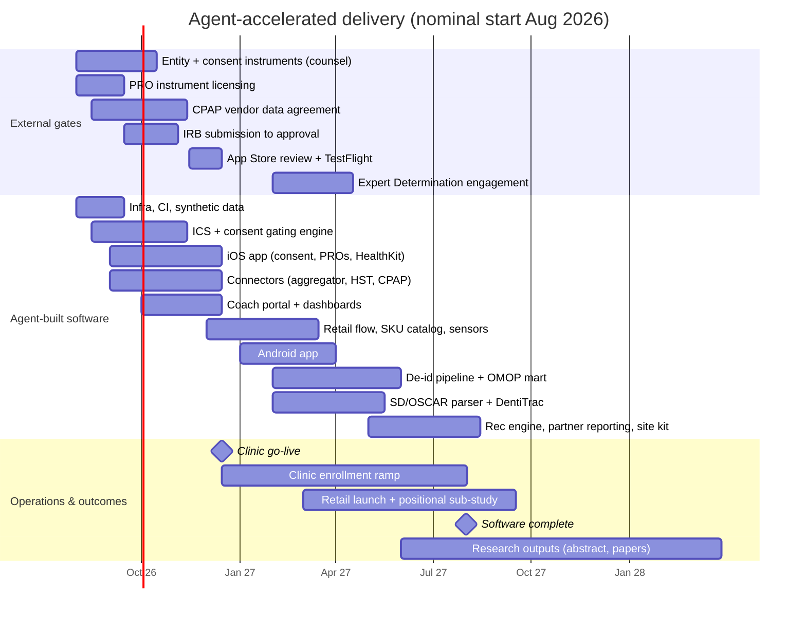

# Sleep Outcomes Data Platform — Delivery Plan (Agent-Accelerated)

| | |
|---|---|
| **Version** | 0.1 (draft) |
| **Date** | July 7, 2026 |
| **Companion documents** | [SPEC.md](SPEC.md) (§13 roadmap phases) · [EVALUATION.md](EVALUATION.md) (independent measurement) |

This plan answers three questions: how long the whole build takes start to finish, how many AI agents can productively work on it, and how the phases in [SPEC.md §13](SPEC.md) map onto an agent-accelerated calendar. The phases and their exit criteria are unchanged — this document compresses the calendar, not the scope.

---

## 1. The one honest premise

**Agents compress engineering time; they do not compress the critical path.** This project's critical path runs through IRB approval, counsel-reviewed consent instruments, vendor data agreements, an Expert Determination opinion, App Store review, hardware provisioning — and, after go-live, patient enrollment and research publication. None of those move faster because agents exist. The result:

| | Human-paced (SPEC §13) | Agent-accelerated (this plan) |
|---|---|---|
| All software built (through P4 scope) | ~24 months | **~12 months** (band: 10–14) |
| Clinic go-live (first enrollee) | month ~9 | **month 4–5** (gated by IRB, not code) |
| Full §3.5 finished-and-successful | months 30–36 | **months 30–36 — unchanged.** Enrollment, publication, and partner revenue accrue in human time |

Engineering effort (~30–40 eng-months in [TECHNICAL.md §T5](TECHNICAL.md)) collapses to roughly 12 calendar months because agent workstreams run in parallel — but only up to the limit of human review bandwidth (§4).

---

## 2. Start-to-finish timeline

Nominal start August 2026; shift all dates by the actual start offset.

**Month-by-month narrative:**

- **M0–M1 — Drafting sprint.** Agents draft everything reviewable: IRB protocol, Lane A/B/C consent instruments, privacy policy, DUA/BAA templates, SAP skeletons, Terraform baseline, CI/CD, the synthetic-data generator ([TECHNICAL.md §T3.3](TECHNICAL.md)). Humans: engage entity counsel and the IRB, start aggregator/cloud contracts and the CPAP vendor conversation, open the Apple developer account, file PRO licensing requests. Agent drafting turns every external review cycle into a same-day revision loop — this is where agents *do* touch the critical path.
- **M1–M3 — Build against drafts.** Counsel iterates instruments; IRB submission ~M2, approval ~M3 (commercial IRB). In parallel, agents build the Identity & Consent Service and consent-gating engine, data-model migrations, aggregator sandbox integration, the iOS app skeleton, HST intake with its quarantine queue, and the coach portal alpha — all against draft instruments, frozen on IRB approval.
- **M3–M5 — Harden and launch clinic.** Instruments frozen; CPAP export ingestion live; PRO engine + SMS fallback; descriptive dashboards; the revocation drill passing in CI (release-blocking); TestFlight → App Store; agent-drafted coach training materials. **Clinic go-live ≈ end of M4** — gated by IRB and App Store, not by code. *(= SPEC §13 P1, months 3–9 human-paced.)*
- **M4–M7 — Retail and instrumentation.** Retail flow, SKU catalog, POS form, sensor-cohort provisioning, Withings path, Android app, positional sub-study tooling. **Retail launch M6–7.** *(= P2, months 8–15 human-paced.)*
- **M6–M10 — Depth.** SD-card/OSCAR parser; DentiTrac export integration (gated on the dental partner — may slip independently); de-id pipeline + OMOP mart with the Expert Determination engagement running M6–M9; analyst workbench; external-access workflow. *(= P3 software, months 14–24 human-paced.)*
- **M9–M12 — Intelligence & scale.** Recommendation engine v1 inside the SPEC §10.3 guardrails, partner reporting, multi-site onboarding kit. **Software complete ≈ M12.** *(= P4 build scope.)*
- **M12 onward — the part agents can't do.** Enrollment accrual toward the §3.5 targets, sub-study data collection, abstract → methods paper → findings paper, first sponsored study. Full finished-and-successful per SPEC §3.5: **months 30–36 from start.**

**Critical-path items to watch** (every one external): IRB approval (M3), consent instruments final (M3), CPAP vendor terms (M2–4 — fallbacks specced in [TECHNICAL.md §T1.2](TECHNICAL.md) if it drags), Expert Determination opinion (M9), dental partner for DentiTrac, Tempur-Sealy API (optional by design, SPEC R4).

---

## 3. Agent staffing plan

Workstreams map to [TECHNICAL.md §T5](TECHNICAL.md). One agent owns one workstream at a time; verification agents are a separate pool governed by [EVALUATION.md](EVALUATION.md) and **never write product code**.

| Window | Build agents | Verification agents (independent) | Humans |
|---|---|---|---|
| M0–M1 | 5–6: infra/IaC · ICS · data model · iOS skeleton · document drafting (protocol, instruments, policies) · synthetic data | 2: compliance cross-checker (drafts vs. SPEC §4) · security/IaC reviewer | Ben + 1 senior engineer; counsel and IRB external |
| M1–M5 (peak) | **8**: ICS/consent · connectors ×2 (aggregator; HST+CPAP) · iOS · coach portal/dashboards · PRO engine · infra hardening · docs/runbooks | **4**: code review · compliance drills · red team · data quality | **2 senior engineers** reviewing/merging + Ben |
| M4–M7 | 6–8: retail flow · Android · sensor provisioning · sub-study tooling · hardening carryover | 3–4 (same roles) | 2 + Ben |
| M6–M12 | 5–7: de-id/OMOP · SD parser · DentiTrac · rec engine · partner reporting · onboarding kit | 3–4 (re-identification red team becomes the priority role) | 2 + Ben; ED firm external |
| Post-launch steady state | 2–3 maintenance/iteration | 2 continuous-evaluation agents on schedule (EVALUATION.md cadences) | 1 + Ben |

**How many agents *can* we run, versus how many are productive.** The tooling ceiling is not the constraint — a dozen or more concurrent agents run fine. The binding constraints are:

1. **Human review bandwidth.** A senior reviewer can meaningfully supervise ~4–6 parallel workstreams; beyond that, agents queue behind review and concurrency is theater. With two senior engineers plus Ben, the productive ceiling is **~8 build agents + 4 verification agents ≈ 12 concurrent**, peaking in M1–M5.
2. **The PHI domain.** Anything touching consent enforcement, the identity service, de-identification, or security paths requires human sign-off before merge — no exceptions, agents included (working agreements below).
3. **Integration seams.** ICS contracts, the canonical Observation schema, and the consent-gating semantics ([TECHNICAL.md §T2](TECHNICAL.md)) are built first and frozen early precisely so parallel agents don't collide on them.

**Working agreements:**

- No agent reviews its own work; every merge has a human approver, and consent/security/de-id paths require a senior engineer specifically.
- Build agents work from SPEC/TECHNICAL as the contract; spec changes route through Ben, not through code.
- Verification agents (EVALUATION.md) run in a separate environment with read-only access and cannot modify product code or evaluation thresholds.
- The revocation drill and the EVALUATION.md release-gate checks are wired into CI as release-blocking from M2 onward.
