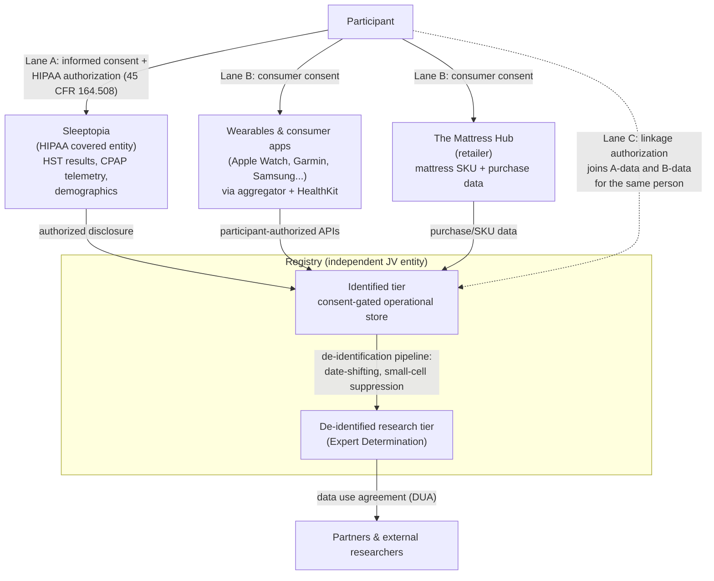
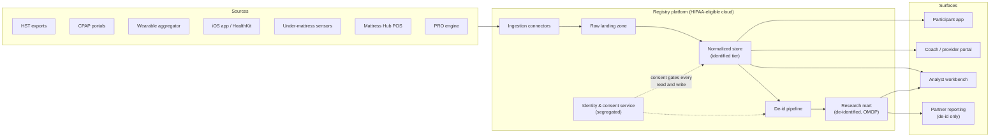

# Sleep Outcomes Data Platform — Specification

| | |
|---|---|
| **Version** | 0.2 (draft) |
| **Date** | July 7, 2026 |
| **Prepared by** | Ben Davis, Cato Consulting Group |
| **Prepared for** | Kevin Kunz, Sleeptopia Inc. · The Mattress Hub |
| **Status** | Draft for partner and counsel review |
| **Companion document** | [TECHNICAL.md](TECHNICAL.md) — technical appendix for the development team |

**Changelog**

| Version | Date | Change |
|---|---|---|
| 0.1 | 2026-07-07 | Initial draft |
| 0.2 | 2026-07-07 | Added §3.5 Definition of Finished & Successful (combined definition of done and success criteria) |

---

## 1. Executive Summary

Sleeptopia and The Mattress Hub will build a **consented, HIPAA-grade sleep outcomes registry**: a database that links clinical sleep-apnea data (home sleep tests, CPAP therapy telemetry, oral appliance therapy) with mattress data, consumer wearable data, and patient-reported outcomes — for the purpose of proving which sleep-apnea treatment combinations actually work in the real world.

**The novel bet.** Roughly half of obstructive sleep apnea (OSA) patients have *positional* OSA — their apnea is markedly worse when sleeping on their back. Nobody has linked mattress and sleep-position data to clinical apnea outcomes at scale. Sleeptopia diagnoses and treats OSA; The Mattress Hub sells the sleep surface those patients lie on every night. Together they sit on both sides of a question no one else can answer: **do specific mattresses measurably change outcomes for positional sleep apnea?** That question is the wedge; the registry built to answer it becomes the durable asset.

**The business case, in three sentences.** Each enrolled participant makes the dataset more valuable, and a more valuable dataset attracts partners (mattress manufacturers, wearable vendors, dental sleep practices, eventually payers) whose participation enrolls more participants — a data network effect. Published research converts the dataset into credibility that no competitor in either partner's market can buy. The value is never the sale of patient data; it is sponsored studies, de-identified analytics under strict data-use agreements, and the competitive moat of being the party who *knows what works*.

**The two hard problems, stated honestly.** First, the legal architecture: Sleeptopia is a HIPAA covered entity, The Mattress Hub is a retailer that HIPAA does not cover at all, and consumers' wearable data is governed by a *different* body of law (FTC and state consumer-health-data rules). "Make it HIPAA compliant" is necessary but not sufficient — this spec designs a dual-track compliance framework (§4). Second, the integration reality: some data sources Kevin's vision names have no public API (Tempur-Pedic's Sleeptracker), and others need vendor-terms verification (CPAP telemetry). This spec provides a primary path and a fallback for every source (§5), so no single vendor decision can stall the platform.

**What success looks like** (headline milestones — the full combined definition of finished-and-successful is §3.5):

| Horizon | Milestones |
|---|---|
| 12 months | Legal/IRB foundation complete; registry live at Sleeptopia; 300–600 enrolled participants; CPAP + wearable + PRO data flowing; baseline-capture discipline established |
| 24 months | Mattress Hub retail enrollment live; instrumented under-mattress-sensor cohort running; positional-OSA sub-study enrolling; first conference abstract; 1,500–3,000 participants |
| 36 months | First peer-reviewed publications; first manufacturer-sponsored study; multi-site expansion (additional DME/dental practices) underway; de-identified research mart open to external researchers under DUA |

---

## 2. Background & Parties

### 2.1 Sleeptopia Inc.

Sleeptopia (Wichita, KS, founded 2013) is an **end-to-end sleep apnea service provider**: home sleep tests (HSTs) that monitor breathing, oxygen levels, and heart rate; CPAP machines, masks, and supplies as the durable medical equipment (DME) provider of record; and sleep coaches who support patients through diagnosis and therapy. Sleeptopia works with all insurances and maintains NPI numbers — it is a **HIPAA covered entity**, and everything it contributes to this platform is protected health information (PHI) until it crosses a legal boundary designed in §4.

What Sleeptopia brings:

- **Clinical ground truth**: HST results including the apnea-hypopnea index (AHI), oxygen desaturation index (ODI), SpO2, heart rate — and, critically, the **body-position channel** that identifies positional OSA (§5.1).
- **CPAP telemetry at the provider level**: as the DME provider, Sleeptopia has provider-side access to adherence data (ResMed AirView, Philips Care Orchestrator) — nightly usage hours, residual AHI, mask leak. This is the platform's unfair advantage: this data is expensive and slow for anyone else to obtain (§5.2).
- **An enrollment engine**: sleep coaches who already sit with every patient at diagnosis and setup — the natural moment to enroll participants (§9.1).

### 2.2 The Mattress Hub

The Mattress Hub is a Wichita-based mattress retailer with stores across Kansas, Missouri, and Oklahoma, and an authorized Tempur-Pedic dealer. It is **not** a HIPAA covered entity; its lane in this platform is consumer data collected with consumer consent (§4, Lane B).

What The Mattress Hub brings:

- **Recruitment at scale**: retail foot traffic of people actively spending money to sleep better — a self-selected population enriched for sleep problems, reachable before any clinical encounter.
- **Mattress ground truth**: purchase data — brand, model/SKU, firmness, size, purchase and delivery dates — as structured data requiring no device integration at all (§5.4).
- **The Tempur-Sealy relationship**: the commercial path to a Sleeptracker data partnership and to manufacturer-sponsored studies (§12).

### 2.3 The joint venture

The data platform is the partnership's product. The recommended structure is an **independent registry entity** jointly governed by the partners (the analysis and alternative are in §4.3); its governance, IP, and publication policies are open items assigned in §14.

### 2.4 Why now

Consumer wearables with sleep, heart-rate, HRV, and SpO2 sensing are ubiquitous; aggregator APIs have collapsed the cost of integrating them. The positional-OSA literature has matured enough to make position-focused studies publishable. Payers are shifting toward outcomes-based evidence. And the two partners have just formed the relationship that puts clinical and environmental data under one roof.

---

## 3. Goals & Non-Goals

### 3.1 Goals

Each goal restates one of the founding vision points as a testable objective.

| # | Goal | Vision point |
|---|---|---|
| G1 | Operate a single registry combining CPAP therapy data, oral appliance therapy data, mattress data (with Tempur-Pedic as the priority brand), and wearable data (Apple Watch, Garmin, Samsung, and others via aggregator) | 1 |
| G2 | Operate under a compliance architecture with documented patient consent for every data element, and produce de-identified data through a defensible, audited pipeline | 2 |
| G3 | Capture a pre-treatment baseline and longitudinal follow-up for every participant, so before/after outcome changes are measurable per participant | 3 |
| G4 | Determine whether specific mattress models/firmness levels change supine sleep time and positional-apnea outcomes in HST-confirmed positional OSA patients | 4 |
| G5 | Compare outcomes across CPAP, oral appliance, mattress-only, and combination cohorts with pre-specified confounder adjustment | 5 |
| G6 | Measure sleep quality (stages, duration, efficiency), SpO2, resting heart rate, HRV, movement, snoring, and CPAP adherence as standardized endpoints | 6 |
| G7 | Build the deepest *linked* clinical + mattress + wearable longitudinal sleep dataset, with multi-site onboarding as the path to scale (see refinement R7) | 7 |
| G8 | Publish peer-reviewed research from the registry; power per-participant recommendations from the identified tier; validate treatment approaches | 8 |
| G9 | Establish data partnerships with mattress manufacturers, wearable vendors, healthcare organizations, and (later) insurers — under data-use agreements, never data sale | 9, 10 |

### 3.2 Non-goals

Each non-goal defuses a specific scope or liability trap.

- **Not a diagnostic device.** The platform never diagnoses OSA or directs therapy changes; doing so would make it an FDA-regulated medical device (§10.3).
- **Not a data brokerage.** No sale of identified or de-identified data. Partners receive analyses and DUA-governed de-identified access (§12.3).
- **Not an EHR, CRM, or e-commerce system.** The registry links to Sleeptopia's existing systems; it does not replace them.
- **Not real-time clinical monitoring.** No alerting on live physiological data (e.g., "notify if SpO2 drops") — that creates a duty-to-act the venture cannot staff.
- **Not a consumer sleep-coaching app** in v1. The participant app exists to consent, connect devices, answer surveys, and show participants their own trends.
- **No pediatric participants, no substance-use-disorder (42 CFR Part 2) data, no genomics.** Each drags in a regulatory regime that adds nothing to the thesis.
- **No international scope.** KS/MO/OK footprint; no GDPR design burden.

### 3.3 Design principles

1. **Consent-first**: no data element is collected without a consent or authorization that names it; consent state is enforced by the system, not by policy documents (§8.4).
2. **Two-tier data**: an identified tier powers the product; a de-identified tier powers research and partnerships. Conflating them breaks one or the other (R2).
3. **Buy, don't build, at the edges**: aggregators for wearables, commercial IRB, purchased Expert Determination — custom engineering is reserved for what makes this platform unique (linkage, consent enforcement, the research mart).
4. **Publish or it didn't happen**: research credibility is the moat; the publication program (§11) is a first-class workstream, not a marketing afterthought.

### 3.4 Refinements to the original vision

These twelve changes sharpen the founding plan while staying entirely inside its end goal. Each is developed in the referenced section.

| # | Refinement | Where |
|---|---|---|
| R1 | **"HIPAA-compliant" is necessary, not sufficient.** Half the platform's data (wearables, retail) never touches HIPAA and is instead governed by the FTC Health Breach Notification Rule and state consumer-health-data laws. The spec designs a dual-track framework; otherwise the riskiest data is the ungoverned data. | §4.2 |
| R2 | **Add an identified tier — a de-identified-only database kills the product.** Per-patient AI recommendations, before/after linkage, and re-contact all require identified data held under HIPAA authorization. De-identification is the *output pipeline* for research and partners, not the database's operating state. | §4.4 |
| R3 | **Use Expert Determination, not Safe Harbor, for de-identification.** Safe Harbor strips dates and geography, which destroys longitudinal before/after analysis and the Wichita cohort's utility. Expert Determination with date-shifting preserves both. | §4.4 |
| R4 | **Tempur-Pedic has no public API — stop assuming it.** Treat Tempur-Sealy partner access as a roadmap bet pursued through the dealer relationship, and de-risk with a study-supplied under-mattress sensor cohort plus mattress SKU metadata captured at the point of sale, which needs no API at all. | §5.4 |
| R5 | **Engage an IRB before the first enrollee.** Publication requires IRB-reviewed research; retrofitting consent for data already collected is somewhere between painful and impossible. Commercial IRB engagement is a Phase 0 deliverable. | §4.5, §13 |
| R6 | **Position data won't come from wearables.** Consumer wearables largely do not report body position. The positional-OSA thesis requires the HST position channel at baseline and under-mattress sensors longitudinally — a funded, designed capability, not an assumed one. | §5.4, §6.3 |
| R7 | **Rescale the "largest database" claim.** A Wichita-metro clinical funnel plus regional retail yields hundreds to low thousands of participants per year. The honest — and stronger — claim is the *deepest linked* clinical + mattress + wearable dataset. Multi-site onboarding of other DME and dental practices is the actual path to scale. | §12.1 |
| R8 | **Name the selection-bias problem and pre-empt it.** People recruited while buying premium mattresses are systematically unrepresentative. Pre-specify confounder capture, use propensity methods, and frame findings as hypothesis-generating, with an embedded pragmatic trial as a later credibility upgrade. | §6.4 |
| R9 | **Baseline capture is an operations problem, not a data problem.** Before/after tracking dies if enrollment happens after treatment starts. Both enrollment flows are built around a 2–4 week pre-intervention baseline window — and retail's mattress-delivery lag is a gift here. | §6.2, §9 |
| R10 | **Buy the wearable layer via one aggregator.** A single aggregator integration replaces five brittle native integrations; the only mandatory native work is an iOS app for Apple HealthKit. This cuts months from the build. | §5.5 |
| R11 | **CPAP provider-side data is the crown jewel — verify the license.** Vendor terms for AirView/Care Orchestrator may not cover research/secondary use. Get written confirmation in Phase 0, with patient-level consent fallbacks (myAir authorization, SD-card ingest) specced and ready. | §5.2 |
| R12 | **"Not selling data" still needs a business model — write it down.** The revenue lines are sponsored studies, de-identified analytics subscriptions, and validation services, all under DUA, with contractual guardrails that make the no-selling pledge verifiable. Without this the venture's economics are a hand-wave, and partners will notice. | §12.4 |

### 3.5 Definition of Finished & Successful

"Finished" and "successful" are one definition, on purpose. A registry that is fully built but has proven nothing is not finished — it is an expensive database. Each capability below therefore pairs its build-complete condition with the measurable outcome that shows it working. **The platform is done when every row holds true — and stays true.** Phase exit criteria in §13 are the intermediate checkpoints that roll up to this table.

| Capability | Built when… | Successful when… |
|---|---|---|
| **Compliance foundation** | Entity formed; IRB-approved protocol live; Lane A/B/C consent instruments in production; BAAs and DUA templates executed; the consent-revocation drill passes end-to-end ([TECHNICAL.md §T3.3](TECHNICAL.md)) | Every stored data element traces to a current consent; revocations propagate within one sync cycle; zero reportable breaches or unauthorized disclosures — verified by annual audit, not asserted |
| **Enrollment engine** | Clinic and retail funnels both live, each holding the baseline-window discipline (§6.2) | 300–600 consented participants by month 12; 1,500–3,000 by month 24; ≥ 400 Lane-C **linked** participants by month 24 (the platform's most valuable cohort); baseline window captured for ≥ 70% of enrollees |
| **Data engine** | All five source classes (§5.1–5.5) plus the PRO battery (§5.6) flowing into the identified tier | ≥ 80% of active participants meet the ≥ 14-valid-nights/month rule (§6.5); CPAP telemetry present for ≥ 90% of CPAP participants; mattress SKU attached to ≥ 95% of enrolled retail purchases; day-90 PRO completion ≥ 60% |
| **Research engine** | OMOP research mart live and versioned under an Expert Determination opinion; statistical analysis plans pre-specified; external-access workflow operating (§11.4) | Registry methods paper published; the flagship positional-OSA sub-study delivers a well-powered answer to G4 — **in either direction**: a definitive "mattress choice doesn't move positional outcomes" is success; an underpowered shrug is failure |
| **Business engine** | Partner reporting on the de-identified tier; recommendation engine v1 shipped inside the §10.3 guardrails; multi-site onboarding kit ready | ≥ 1 sponsored study signed; ≥ 1 external site (DME or dental practice) contributing data; the STOP-BANG → HST referral funnel measurably generating Sleeptopia patients; partner revenue covering platform operating costs by month 36 |

The single-sentence test, for the partners' wall:

> The platform is finished and successful when a participant can walk in through either front door, be consented in plain language, have their sleep measured before and after treatment without manual heroics, and — pooled with a few thousand others — teach us something about positional sleep apnea worth publishing; when a partner is paying for those insights under a DUA; and when not one byte of identifiable patient data has ever been sold or leaked.

**Explicitly not success**: raw enrollment counts without linked, baseline-complete participants; dashboards without publications; a technically complete platform whose consent, baseline, or data-quality discipline has quietly eroded. This table is the tripwire that surfaces §14's risks early — review it against live numbers quarterly.

---

## 4. Compliance & Legal Architecture

> This section is a design for counsel to validate, not legal advice. Open questions for counsel are listed in §14.
>
> Implementation detail: [TECHNICAL.md §T3–T4](TECHNICAL.md).

### 4.1 The problem shape

Three kinds of parties handle data in this platform, and each sits under a different body of law:

- **Sleeptopia** is a HIPAA covered entity. Its data is PHI, governed by the HIPAA Privacy, Security, and Breach Notification Rules.
- **The Mattress Hub** is a retailer. HIPAA does not apply to it at all — which does not mean its data is unregulated (see Lane B).
- **Consumers/participants** contribute wearable and app data directly. Collected outside a covered entity, that data is *not* PHI — it is consumer health data governed by the FTC Act, the FTC Health Breach Notification Rule, and a growing set of state consumer-health-data laws.

Any design that treats "HIPAA compliance" as the whole answer leaves the consumer lane ungoverned and the retail lane in limbo. The architecture below gives every data flow exactly one legal lane.

### 4.2 The three-lane data-flow design

**Lane A — Clinical (Sleeptopia → registry).** At enrollment, the patient signs a **combined informed-consent form (ICF) and HIPAA research authorization** (45 CFR §164.508). Under that authorization, Sleeptopia discloses identified clinical data — HST results, CPAP telemetry, relevant demographics and diagnosis metadata — to the registry. The authorization names the registry, the data elements, the research purpose, an expiration or event, and the right to revoke. For partner-facing sharing that needs dates and geography but not names, a **Limited Data Set under a Data Use Agreement** (45 CFR §164.514(e)) is the middle path between fully identified and fully de-identified data.

**Lane B — Consumer (wearables, retail → registry).** The registry's participant app collects wearable, mattress-sensor, purchase, and survey data **directly from consumers** under a consumer consent. No covered entity touches this flow, so it is not PHI — but it is squarely regulated consumer health data: the **FTC Health Breach Notification Rule** applies to the registry app as a vendor of personal health records, FTC Act §5 governs every promise the consent makes, and state consumer-health-data laws apply to any participant from a state that has one. The consent is designed to the **Washington My Health My Data standard** — separate consent for collection versus sharing, a genuine right to withdraw and delete — even though Kansas has no comprehensive law. This is deliberate future-proofing, and it is a credibility argument when recruiting partners.

**Lane C — Linkage.** A participant who is both a Sleeptopia patient and a consumer enrollee (the platform's most valuable cohort) signs a **linkage authorization** that permits joining their Lane A and Lane B records under a single participant ID. The tokenization and matching mechanics are specified in [TECHNICAL.md §T3.4](TECHNICAL.md). Without Lane C consent, a person's clinical and consumer records remain permanently unjoined.

### 4.3 Who operates the registry: entity and role analysis

Two viable structures; the choice is the single most consequential legal decision and belongs to counsel (§14).

**Option A — Registry as Sleeptopia's business associate.** The registry operator signs a BAA with Sleeptopia; Lane A data remains PHI end to end.
*Advantages*: simpler revocation story (HIPAA rights follow the data); no disclosure boundary to defend.
*Disadvantages*: The Mattress Hub's role inside a PHI environment is awkward; every partner touch requires HIPAA analysis; the de-identified tier still has to be built anyway.

**Option B — Independent JV entity receiving authorized disclosures (recommended).** The registry is its own entity. Lane A data leaves HIPAA at the authorized-disclosure boundary; from then on the registry is governed by its own consent terms, the FTC regime, and contract law.
*Advantages*: clean Mattress Hub participation; clean partner sharing; one consistent consumer-facing privacy promise across all lanes; the "we are an independent research registry" positioning helps recruitment and publication.
*Disadvantages*: the disclosure boundary must be operated correctly every time; revocation semantics must be written into the registry's own consent (this spec does so — §9.4).

Either way: **BAAs with every vendor** (cloud, e-signature, survey delivery) that handles Lane A data *before* the disclosure boundary, and contractual flow-downs of the registry's privacy promises to every subprocessor after it.

### 4.4 Two-tier data design

- **Identified tier.** Operational store. Holds consented, identified data under Lane A/B/C instruments. Powers everything that must know who the participant is: baseline/follow-up linkage, per-participant AI recommendations (§10), survey delivery, re-contact for sub-studies, incentive fulfillment. Access is role-restricted and audit-logged; partners never touch it.
- **De-identified research tier.** Produced from the identified tier by a governed pipeline using **Expert Determination** (45 CFR §164.514(b)(1)) rather than Safe Harbor — Safe Harbor's blanket stripping of dates and geographic detail would destroy the longitudinal before/after analyses and the Wichita-area cohort structure this platform exists to study. The Expert Determination controls include per-participant **date-shifting** (a consistent random offset preserving intervals), **small-cell suppression**, generalization of rare attributes, and a re-identification risk assessment purchased from an established privacy-statistics firm (no home-grown methodology — §3.3). This tier is what researchers and partners see, always under DUA.

### 4.5 Research legitimacy

- **IRB before the first enrollee.** A registry protocol is submitted to a commercial IRB (WCG or Advarra) in Phase 0, covering the registry itself and pre-specified sub-studies. The combined ICF + authorization (Lane A) and consumer consent (Lane B) are IRB-reviewed instruments.
- **Consent documents** meet Common Rule elements (voluntary, risks/benefits, withdrawal, contacts) in plain language at an 8th-grade reading level.
- **ClinicalTrials.gov registration** is evaluated per sub-study with the IRB; observational registries generally may register voluntarily — a credibility positive.
- Publication prerequisites are in §11.2.

### 4.6 Obligations matrix

| Party | HIPAA Privacy/Security/Breach | FTC HBNR + FTC Act §5 | State breach laws (KS/MO/OK) | State consumer-health laws | Satisfying artifacts |
|---|---|---|---|---|---|
| Sleeptopia | Yes — covered entity | No | Yes | No | ICF + authorization; disclosure accounting; existing HIPAA program |
| The Mattress Hub | No | Yes, for its role in the app funnel | Yes | Yes, for out-of-state participants | Consumer consent flow; data-handling contract with registry |
| Registry (JV) | Only pre-disclosure vendors (BAA); as BA under Option A | **Yes — primary regime** (PHR vendor) | Yes | Yes — designed to WA MHMD standard | Consent instruments; privacy policy; breach runbook; DUA templates; de-id Expert Determination |
| Cloud & subprocessors | BAA required for Lane A pre-disclosure data | Flow-down contract terms | Contract | Contract | BAAs; subprocessor agreements |

**Cross-cutting commitments:** consent revocation is honored programmatically (§8.4, §9.4); a written retention schedule caps how long each tier holds data; **minors are excluded**; and every partner contract contains the marketing-use prohibitions and no-resale covenants that make "we don't sell patient data" contractually true rather than aspirational.

---

## 5. Data Sources & Integrations

Every source class below follows the same structure: what it measures → how we acquire it (primary and fallback) → data elements and cadence → consent lane → known gaps. Full integration specifications: [TECHNICAL.md §T1](TECHNICAL.md).

### 5.1 Home sleep tests & clinical diagnostics (Sleeptopia)

- **What it measures.** The clinical anchor: AHI, ODI, SpO2 profile, heart rate — and the **body-position channel**. Most modern HST devices record sleeping position, allowing supine vs. non-supine AHI to be computed. This single field defines the positional-OSA cohort (G4) and is the study's linchpin. STOP-BANG screening scores and diagnosis metadata (date, severity class, ordering provider) complete the picture.
- **Acquisition.** Primary: structured exports from Sleeptopia's HST platform into the registry's Lane A intake (report parsing where structured export is unavailable). Fallback: manual abstraction by sleep-coach staff for legacy records.
- **Elements & cadence.** One record per study night; baseline for every clinical enrollee, repeat HSTs when clinically ordered.
- **Consent lane.** A.
- **Known gaps.** Position-channel format varies by HST vendor; normalization rules live in TECHNICAL.md. Repeat HSTs happen only when clinically indicated — longitudinal position data comes from §5.4 sensors instead.

### 5.2 CPAP therapy telemetry

- **What it measures.** Objective adherence and efficacy: nightly usage hours, residual AHI on therapy, mask leak, pressure delivered (95th percentile), events. CPAP adherence is a primary endpoint (§6.5) and the outcome payers care most about.
- **Acquisition.** Primary: **provider-side access** — Sleeptopia, as DME provider of record, already uses ResMed AirView and Philips Care Orchestrator; nightly telemetry flows to these portals from the modem in every modern CPAP. This is data competitors cannot cheaply obtain (R11). **Phase 0 action:** obtain written vendor confirmation that registry/research use is within the platform terms, or negotiate a data agreement. Fallbacks, specced and ready: patient-authorized access via ResMed myAir / Philips DreamMapper accounts; SD-card ingest using the open OSCAR data path for any machine regardless of vendor cooperation.
- **Elements & cadence.** Nightly summary per participant; near-daily sync via provider portals.
- **Consent lane.** A.
- **Known gaps.** Vendor terms for secondary use (open item, §14). Patients who abandon CPAP stop generating telemetry — which is itself a key outcome and is captured as such, not treated as missing data.

### 5.3 Oral appliance therapy

- **What it measures.** Mandibular advancement device (MAD) usage and titration — the main CPAP alternative, typically delivered by dental sleep medicine practices.
- **Acquisition.** Honest reality: objective adherence sensing for oral appliances effectively means **DentiTrac (Braebon)** — a micro-recorder embedded in the appliance at manufacture, requiring both a participating dentist and a compatible lab. That is a Phase 3 pilot with partner dental practices (§13), not a baseline capability. Primary path at launch: **patient-reported adherence** (nightly wear yes/no + hours, via the app's PRO engine) plus **dentist-reported titration and follow-up records** from partnered practices.
- **Elements & cadence.** Appliance metadata (type, delivery date, titration position); nightly self-reported wear; DentiTrac objective wear-time for the instrumented sub-cohort.
- **Consent lane.** A when records flow from a dental covered entity under authorization; B for self-reported data through the app.
- **Known gaps.** Self-report over-estimates adherence — analyses treat it as such; the DentiTrac sub-cohort exists to calibrate it.

### 5.4 Mattresses & under-mattress sensing

- **What it measures.** The platform's novel exposure variable (which mattress, which firmness) and its novel longitudinal instrument (sleep position, movement, heart/breathing rate, snore detection from under the mattress).
- **Acquisition — three parallel paths, deliberately independent (R4):**
  1. **Mattress metadata as first-class data, no API needed.** At point of sale, The Mattress Hub attaches structured purchase data to the participant record: brand, model/SKU, firmness rating, material class, size, purchase and **delivery date** (which timestamps the exposure change for before/after analysis). A curated SKU catalog with normalized attributes is part of the data model ([TECHNICAL.md §T2](TECHNICAL.md)).
  2. **Study-supplied under-mattress sensor cohort.** Tempur-Pedic's Sleeptracker-AI system has **no public API** — the founding vision's assumption to the contrary is corrected here. Longitudinal position/movement data therefore comes from a registry-supplied under-mattress sensor (Withings Sleep Mat class) issued to the instrumented sub-cohort, particularly positional-OSA participants (§6.3). This works on *any* mattress, which is exactly what a mattress-comparison study needs.
  3. **Tempur-Sealy partner API as a roadmap bet.** Pursued through The Mattress Hub's dealer relationship (§12.1): permissioned access to Sleeptracker data for consented participants. Valuable if it lands; nothing depends on it.
- **Elements & cadence.** SKU record per purchase; nightly sensor summaries (time in bed, position/restlessness proxies, HR, respiratory rate, snore episodes) for the instrumented cohort.
- **Consent lane.** B.
- **Known gaps.** Under-mattress sensors infer position imperfectly (validated against the HST position channel at baseline); sensor cost bounds the instrumented cohort size — a budgeted, not incidental, decision (§13).

### 5.5 Wearables & consumer apps

- **What it measures.** The longitudinal free-living signal: sleep stages, duration, and efficiency; resting heart rate; HRV; SpO2 (device-dependent); movement/restlessness; and snoring via phone-based apps or wearable microphone features.
- **Acquisition.** **Aggregator-first (R10).** One wearable-data aggregator (Terra, Vital/Junction, or Metriport-class — selection criteria and recommendation in [TECHNICAL.md §T1.5](TECHNICAL.md); final pick is a Phase 0 decision) provides normalized, webhook-delivered data across Garmin, Fitbit, Oura, Withings, Samsung, and others through one integration. The exceptions that require native work: **Apple HealthKit** is on-device only, so the registry ships its own iOS app (already required for consent and surveys — the marginal cost is the HealthKit module, and Apple Watch is the most common device in the target demographic); **Android Health Connect** is the analog on the Android fast-follow.
- **Elements & cadence.** Nightly sleep summaries plus daily physiological summaries; raw-sample retrieval only where an analysis needs it.
- **Consent lane.** B.
- **Known gaps.** Wearable sleep-staging accuracy varies by brand — device make/model is recorded with every observation and treated as a covariate; SpO2 availability is inconsistent; missingness is chronic and handled by §6.5 validity rules rather than wished away.

### 5.6 Patient-reported outcomes (cross-cutting)

- **What it measures.** The validated-instrument backbone that makes results publishable: **ESS** (Epworth Sleepiness Scale — daytime sleepiness, the classic OSA outcome), **ISI** (Insomnia Severity Index), **PSQI** (Pittsburgh Sleep Quality Index), **FOSQ-10** (functional outcomes), and **STOP-BANG** (OSA risk screening) at the retail touchpoint.
- **Acquisition.** The app's PRO engine, with SMS fallback for low-app-engagement participants.
- **Elements & cadence.** Full battery at baseline and days 30 / 90 / 180 / 365; STOP-BANG once at retail screening; brief nightly items (appliance wear, subjective quality) where a cohort needs them.
- **Consent lane.** A or B depending on the enrollment touchpoint.
- **Known gaps.** Instrument licensing: several instruments (notably FOSQ and PSQI in commercial contexts) require permissions/fees — a Phase 0 checklist item (§14). Survey fatigue is managed by keeping the between-milestone burden near zero.

---

## 6. Study & Outcomes Design

### 6.1 Master design

A **prospective observational registry** with pre-specified sub-studies — explicitly *not* a randomized controlled trial. The registry supports association findings, hypothesis generation, and adjusted comparative-effectiveness signals (propensity methods, target-trial emulation framing); it does not support causal claims of the strength an RCT provides, and no publication or marketing claim will pretend otherwise. An embedded pragmatic trial (e.g., randomizing mattress firmness among consenting positional-OSA participants) is a designed-for future option (R8), not a v1 commitment.

### 6.2 The before/after core protocol

Every analysis in G3–G6 depends on one operational discipline: **the baseline window**. Participants complete 2–4 weeks of wearable + PRO capture *before* the intervention begins — before CPAP setup, before oral appliance delivery, before the new mattress arrives. This is a requirement on the enrollment flows (§9), not an analytic afterthought (R9). Retail enrollment benefits from a built-in gift: the days between mattress purchase and delivery are a natural baseline window.

### 6.3 Flagship sub-study: positional OSA × mattress

- **Cohort**: HST-confirmed supine-predominant OSA (supine AHI ≥ 2× non-supine AHI, per the HST position channel).
- **Exposure**: mattress change — model, firmness, material class (from §5.4 SKU data), delivery-date-stamped.
- **Outcomes**: percent supine sleep time (under-mattress sensor), positional-apnea proxies, SpO2 and resting HR trends, ESS/ISI/FOSQ change.
- **Measurement**: HST position channel at baseline; under-mattress sensor longitudinally; wearables and PROs per protocol.
- **Power sketch**: detecting a 10-percentage-point reduction in supine sleep time (SD ≈ 20) with 80% power at α = 0.05 needs ≈ 64 participants per comparison group; the instrumented cohort is sized in multiples of this (§13, Phase 2).

### 6.4 Treatment-combination comparisons

Cohorts: CPAP-only, oral-appliance-only, mattress-change-only, and combinations. The central threat is **confounding by indication** — sicker patients get CPAP; wealthier patients buy Tempur-Pedics — so the registry captures the covariate set up front: age, sex, BMI, baseline AHI/severity, comorbidities (self-report checklist), relevant medications, and socioeconomic proxies. The analysis plan (pre-specified per sub-study, §11.2) uses propensity-score adjustment with target-trial emulation framing. Findings are framed as real-world effectiveness signals and hypothesis generators (R8).

### 6.5 Endpoints & data-quality rules

| Tier | Endpoints |
|---|---|
| Primary | CPAP adherence (hours/night, % nights ≥ 4h); residual AHI on therapy; ESS change from baseline |
| Secondary | HRV trend; nocturnal SpO2 profile; sleep efficiency/duration/stages; ISI, PSQI, FOSQ-10 change; % supine sleep time (instrumented cohort) |
| Exploratory | Snore metrics; movement/restlessness; appliance adherence (self-report, DentiTrac-calibrated) |

**Missing-data and validity rules** are pre-specified because wearable data is chronically incomplete: a night counts only with ≥ 3h of recorded sleep; a participant-month counts only with ≥ 14 valid nights; device make/model is a covariate; attrition is reported per cohort in every analysis; and CPAP-telemetry silence after abandonment is an *outcome*, not a gap.

---

## 7. Data Model (summary)

Full schema: [TECHNICAL.md §T2](TECHNICAL.md).

**Core entities, in plain language:**

- **Participant** — one person, one durable pseudonymous ID; identity details live only in the segregated identity service (§8).
- **Consent record** — versioned, per-instrument (Lane A authorization, Lane B consent, Lane C linkage), with full grant/revoke history; every other record is readable only through a consent check.
- **Enrollment / Episode** — a participant's passage through a protocol phase (baseline, intervention, follow-up), with the touchpoint (clinic vs. retail) recorded.
- **Device & Product inventory** — wearables, CPAP machines, sensors, and the **mattress SKU catalog** (brand, model, firmness, material, size) as structured reference data.
- **Sleep Session** — one night from one source; **Daily Summary** — one participant-day rollup; **Observation** — the canonical typed time-series record every source normalizes into.
- **PRO Response** — instrument, version, item scores, total, administration date.
- **Treatment Event** — CPAP setup, appliance delivery, mattress delivery, titration change: the timestamps that split "before" from "after."

**Three grains**: raw signal → nightly session summary → participant-period rollup. Comparative analyses run on the second and third; raw signal is retained for validation and future re-derivation.

**Standards**: the de-identified research mart conforms to **OMOP CDM** (making the registry legible to the observational-research community and multi-site network studies); **FHIR R4** for any provider-facing exchange; LOINC/SNOMED coding where codes exist, plus a documented custom vocabulary for mattress and position concepts that have no standard codes.

---

## 8. System Architecture (summary)

Full detail: [TECHNICAL.md §T3](TECHNICAL.md).

1. **Pipeline**: sources → ingestion connectors → raw landing zone → normalized identified store → de-identification pipeline → OMOP research mart.
2. **Identity & consent service is deliberately segregated** from the outcomes store: the outcomes store knows participants only by pseudonymous ID; names, contacts, and the linkage crosswalk live in a separately secured service. A breach of the outcomes store alone does not identify anyone.
3. **Consent enforcement is architecture, not policy** — the signature design point. Every pipeline read and write is programmatically gated on current consent state; a revocation propagates automatically (stops collection, quarantines identified data per the consent's terms, §9.4). Auditors get logs, not assurances.
4. **Application surfaces**: participant mobile app (iOS first — the HealthKit forcing function — Android fast-follow), sleep-coach/provider portal, research analyst workbench, partner-facing reporting on the de-identified tier only.
5. **Platform posture**: one HIPAA-eligible cloud (selection in TECHNICAL.md), BAA-covered services only in the identified tier, encryption in transit and at rest, role-based access, full audit logging, separated environments.

---

## 9. Consent & Participant Experience

### 9.1 Clinical touchpoint (Sleeptopia)

Sleep coaches are the enrollment engine — they already sit with every patient at the two natural moments (HST results review; CPAP setup).

1. Coach introduces the registry with a one-page plain-language summary (script and 10-minute time budget provided; enrollment must not crowd out clinical duties).
2. Patient e-signs the combined ICF + HIPAA authorization (Lane A) on a tablet.
3. App install; wearable linked via aggregator or HealthKit; CPAP telemetry consent recorded.
4. Baseline PRO battery completed in-visit or within 7 days (app/SMS nudges).
5. Where treatment start allows, the baseline wearable window (§6.2) precedes CPAP setup.

### 9.2 Retail touchpoint (The Mattress Hub)

1. During mattress consultation, associate offers the sleep study via QR code ("get insight into your own sleep; contribute to research").
2. Participant takes the **STOP-BANG screener** in the app — which doubles as a referral funnel: high-risk scorers are offered a Sleeptopia home sleep test. This is a direct, measurable business win for both partners independent of the research value.
3. Consumer consent (Lane B) in plain language: what is collected, what it is used for, sharing rules, deletion rights.
4. Wearable linked **before mattress delivery** — the purchase-to-delivery lag *is* the baseline window (R9).
5. On delivery, the purchase SKU record auto-attaches to the participant; follow-up PRO cadence begins.

### 9.3 The upgrade path (Lane C)

A retail enrollee whose STOP-BANG screen leads to a Sleeptopia diagnosis — or a Sleeptopia patient who later buys a mattress — is invited to sign the linkage authorization, joining their clinical and consumer records. These linked participants are the platform's most valuable cohort, and both flows are designed to funnel toward this state.

### 9.4 Ongoing experience, incentives, withdrawal

- **Retention hook**: participants see their own trends (sleep, HR, adherence) in the app — the registry gives value back, it doesn't just take.
- **Survey cadence** per §5.6; between milestones the burden is near zero.
- **Incentives**: modest and compliant — gift cards or supply discounts, with beneficiary-inducement rules checked for federally insured patients before launch (open item, §14).
- **Withdrawal & deletion**: one-tap withdrawal in-app. Consequences per tier are stated exactly in the consent: collection stops immediately; identified data is deleted or quarantined per the instrument's terms; already-de-identified data in the research tier cannot be recalled (participants are told this up front, in plain language).

---

## 10. Analytics & AI Recommendations

### 10.1 Tiered ambition, in order

1. **Descriptive** — cohort dashboards: enrollment and adherence funnels, outcome trends, data-quality monitors. Ships with Phase 1.
2. **Comparative effectiveness** — the §6 analysis program on the research mart.
3. **Per-participant recommendations** — the AI layer, only after the first two tiers have validated data.

### 10.2 The architectural consequence of the founding vision

Stated bluntly: **per-participant recommendations cannot run on de-identified data.** A recommendation is delivered *to a person*, which requires knowing who they are. The founding vision's points 2 (de-identify everything) and 8 (AI recommendations) conflict unless the platform is two-tiered — which is exactly why §4.4 exists. Recommendations run on the **identified tier**, under the participant's authorization, full stop.

### 10.3 Scope guardrail (FDA non-device CDS)

Recommendations stay inside FDA's non-device clinical-decision-support criteria and wellness framing: mattress/comfort suggestions, adherence-support nudges ("your mask leak rose this week — a refit may help"), and "discuss with your provider" prompts. **Never**: diagnosis, therapy-change directives, or interpretation of physiological signals a clinician hasn't seen. Each recommendation type is documented against this boundary test before it ships.

### 10.4 Model governance

Validation before deployment; performance and drift monitoring after; bias checks explicitly targeting the retail-cohort skew (R8); human-in-the-loop review for anything provider-facing. Model documentation lives with the analysis plans (§11.2).

---

## 11. Research & Publication Program

### 11.1 The year-one-to-three publication ladder

1. Conference abstract at the AASM **SLEEP** meeting (registry design + early enrollment).
2. Registry-description **methods paper** — establishes the platform's existence and rigor in the literature.
3. First **positional-OSA findings paper** from the flagship sub-study.
Target journals: *Journal of Clinical Sleep Medicine*, *Sleep and Breathing*, *SLEEP*.

### 11.2 Prerequisites (all tied to §4)

- IRB-approved protocol **before the first enrollee** (R5).
- A written **publication and authorship policy** between the JV partners, agreed before there is anything to fight over.
- A pre-specified **statistical analysis plan** per sub-study, versioned in the registry's document store, dated before data lock.

### 11.3 Academic partnership

An academic collaborator — KU School of Medicine–Wichita is the natural first conversation — brings methods rigor, IRB fluency, and the co-authorship credibility that gets registry papers past reviewers. The collaboration shape: academic co-investigators on the flagship sub-study, student/fellow analysts on the mart, and joint grant options later.

### 11.4 External researcher access

Qualified external researchers may request de-identified mart access: written request → data-request committee review (both partners represented) → DUA execution → scoped extract. This is also a partnership asset (§12) — the workflow is defined once and reused.

---

## 12. Partnership Strategy

### 12.1 Partner tiers

| Partner | They get | They give | When |
|---|---|---|---|
| **Tempur-Sealy** (first target, via Mattress Hub dealer relationship) | Co-branded studies on their products; findings for marketing (with claim discipline) | Sleeptracker API access for consented participants; co-funding | Phase 2–3 |
| Wearable vendors | Validation studies of sleep metrics against clinical ground truth (HST) | Device support, co-funding, API partnership | Phase 2+ |
| **Dental sleep practices & regional DME providers** | Registry infrastructure for their patients; co-authorship | Multi-site data contribution — **the realistic path to scale** (R7) | Phase 3+ |
| Payers | Real-world adherence/outcomes evidence for coverage decisions | Later-phase revenue; never a v1 dependency | Phase 4 |
| Academic (§11.3) | Data access, co-authorship | Methods rigor, credibility | Phase 1+ |

### 12.2 The moat, stated precisely

What no one else has is **linked, longitudinal, consent-provenanced data across the clinical and environmental sides of sleep**: the same person's diagnosis, therapy telemetry, mattress, wearable signal, and patient-reported outcomes over years. Wearable companies have signal without diagnosis; clinics have diagnosis without environment; mattress companies have neither. Every partner integration deepens the linkage and widens the funnel — the network effect compounds.

### 12.3 Rules of engagement

Partners receive **analyses, and de-identified or Limited-Data-Set access under DUA**. Never identified data. Never raw resale. Every DUA prohibits re-identification attempts, onward transfer, and marketing use of participant-level data. This is what operationalizes "the value isn't selling patient data" — as contract terms, not a slogan.

### 12.4 Revenue model (R12)

- **Sponsored studies**: a manufacturer funds a defined sub-study on its products (mid five to six figures per study, at market rates for real-world evidence work).
- **De-identified analytics subscriptions**: recurring partner access to mart dashboards/extracts under DUA (low-to-mid five figures annually per partner).
- **Validation services**: wearable-vs-clinical-ground-truth studies for device vendors.
- Bands are deliberately rough — the point is that the no-selling pledge coexists with a real business, and the guardrails of §12.3 apply to every line.

---

## 13. Implementation Roadmap

Phases sequence the full vision; nothing is cut. Each phase's exit criteria are intermediate checkpoints toward the combined definition of finished-and-successful in §3.5. Effort bands assume a small senior team (shape in [TECHNICAL.md §T5](TECHNICAL.md)); dollar bands are order-of-magnitude for planning, not quotes.

| Phase | Months | Contents | Exit criteria | Effort |
|---|---|---|---|---|
| **P0 — Legal & governance** | 0–3 | Entity structure decision (§4.3) and formation; counsel-reviewed consent/authorization/linkage instruments; IRB protocol submitted; CPAP vendor-terms confirmation (R11); instrument licensing; aggregator + cloud selection; vendor BAAs | IRB approval; instruments final; vendors contracted | Mostly legal spend + ~1 eng-month |
| **P1 — Core registry** | 3–9 | Identity & consent service; iOS app (consent, PROs, HealthKit); aggregator integration; PRO engine; CPAP AirView/Care Orchestrator ingestion; HST intake; Sleeptopia enrollment flow live; descriptive dashboards | First 100 enrollees; baseline discipline holding; data flowing from all P1 sources | ~10–14 eng-months |
| **P2 — Retail & positional study** | 8–15 | Mattress Hub in-store flow + STOP-BANG funnel; SKU catalog + POS attachment; under-mattress sensor cohort provisioning; positional-OSA sub-study launch; Android app | Retail enrollment live; instrumented cohort ≥ 2× power target (§6.3) | ~8–10 eng-months |
| **P3 — Depth & research output** | 14–24 | Oral appliance arm (PRO adherence + DentiTrac pilot with partner dentists); de-id pipeline + Expert Determination engagement; OMOP research mart; first abstract + methods paper; Tempur-Sealy API track | Mart live under DUA process; abstract submitted | ~8–10 eng-months |
| **P4 — Intelligence & scale** | 20+ | Per-participant recommendations (identified tier, §10.3 guardrails); partner data products; multi-site onboarding kit for DME/dental practices | First external site live; first sponsored study signed | Ongoing |

---

## 14. Risks & Open Questions

### 14.1 Risk register

| Risk | Likelihood | Impact | Mitigation |
|---|---|---|---|
| Enrollment shortfall | Medium | High | Two independent funnels (clinic + retail); STOP-BANG referral value prop; participant-facing trends as retention hook; multi-site expansion accelerates if needed |
| Wearable data missingness | High | Medium | §6.5 validity rules; device covariates; SMS-based PRO fallback keeps outcomes flowing when devices don't |
| Tempur-Sealy partnership never materializes | Medium | Low–Medium | By design: under-mattress sensors + SKU metadata carry the mattress thesis without any manufacturer API (R4) |
| CPAP vendor ToS blocks secondary use | Medium | High | P0 written confirmation; myAir/DreamMapper patient-authorized fallback; SD-card/OSCAR ingest path specced |
| Consent-revocation complexity | Medium | Medium | Programmatic consent gating (§8.4); per-tier consequences stated in instruments; revocation drills in test plans |
| JV governance dispute | Low | High | Entity, IP, publication, and data-ownership terms written in P0 — before there is anything to fight over |
| Data breach | Low | High | Segregated identity service; encryption; audit logging; breach runbook ([TECHNICAL.md §T4](TECHNICAL.md)); insurance |
| Selection bias undermines credibility | High | Medium | Named and pre-empted (R8): confounder capture, propensity methods, hypothesis-generating framing, pragmatic-trial upgrade path |

### 14.2 Open questions, with owners

| # | Question | Owner |
|---|---|---|
| 1 | Entity structure: business associate vs. independent JV (§4.3 recommends JV) | Counsel |
| 2 | IRB selection (WCG vs. Advarra) and protocol scope | Counsel + Ben |
| 3 | Wearable aggregator selection (criteria in TECHNICAL.md §T1.5) | Dev lead + Ben |
| 4 | Can Mattress Hub POS/purchase data be shared under the Lane B consent as drafted? | Mattress Hub counsel |
| 5 | CPAP vendor terms: written confirmation for registry use of AirView / Care Orchestrator data | Kevin + counsel |
| 6 | Incentive design vs. beneficiary-inducement rules for federally insured patients | Counsel |
| 7 | PRO instrument licensing (FOSQ-10, PSQI et al.) for commercial-registry use | Ben |
| 8 | Confirm principals' names/titles for the final document (public records show "Kevin Kunz"; verify spelling) | Ben |

### 14.3 Decisions this spec deliberately defers

Cloud vendor final selection (candidates in TECHNICAL.md); Android timing within P2; DentiTrac lab partner; academic partner terms; pragmatic-trial go/no-go (post-P3, evidence-dependent); payer engagement strategy (P4).

---

## Appendix A — Glossary

| Term | Meaning |
|---|---|
| AHI | Apnea-Hypopnea Index — events per hour of sleep; the standard OSA severity measure |
| BAA | Business Associate Agreement — HIPAA contract binding a vendor that handles PHI |
| CDS | Clinical Decision Support |
| CPAP | Continuous Positive Airway Pressure — the first-line OSA therapy |
| DME | Durable Medical Equipment (provider) — Sleeptopia's role for CPAP equipment |
| DUA | Data Use Agreement — contract governing use of shared research data |
| ESS | Epworth Sleepiness Scale — validated daytime-sleepiness questionnaire |
| FOSQ-10 | Functional Outcomes of Sleep Questionnaire (short form) |
| HBNR | (FTC) Health Breach Notification Rule — breach rule for consumer health data outside HIPAA |
| HRV | Heart Rate Variability |
| HST | Home Sleep Test |
| ICF | Informed Consent Form |
| IRB | Institutional Review Board — the ethics body that must approve human-subjects research |
| ISI | Insomnia Severity Index |
| LDS | Limited Data Set — partially de-identified PHI shareable under a DUA |
| MAD | Mandibular Advancement Device — an oral appliance for OSA |
| ODI | Oxygen Desaturation Index |
| OMOP CDM | Observational Medical Outcomes Partnership Common Data Model — research database standard |
| OSA | Obstructive Sleep Apnea |
| PHI | Protected Health Information (HIPAA) |
| PRO | Patient-Reported Outcome |
| PSQI | Pittsburgh Sleep Quality Index |
| SpO2 | Blood oxygen saturation |
| STOP-BANG | Validated OSA risk screener (Snoring, Tiredness, Observed apnea, Pressure, BMI, Age, Neck, Gender) |
