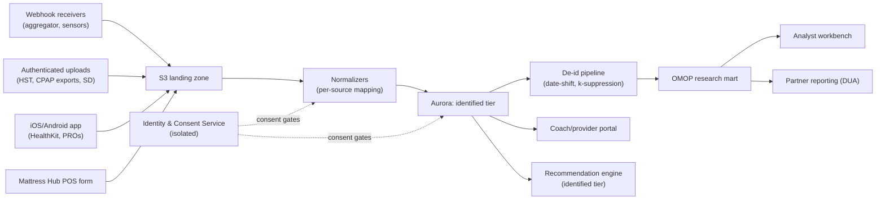

# Sleep Outcomes Data Platform — Technical Appendix

| | |
|---|---|
| **Version** | 0.1 (draft) |
| **Date** | July 7, 2026 |
| **Audience** | Development team |
| **Companion document** | [SPEC.md](SPEC.md) — business specification; section numbers referenced as §N |

This appendix is self-contained enough to build from. Where it restates a decision from SPEC.md, the restatement is normative for implementation.

**Contents**: [T1 Integration specifications](#t1-integration-specifications) · [T2 Data model](#t2-data-model) · [T3 System architecture](#t3-system-architecture) · [T4 Security & privacy controls](#t4-security--privacy-controls) · [T5 Build estimates](#t5-build-estimates)

---

## T1. Integration specifications

Depth is deliberately uneven (SPEC §3.3: buy, don't build, at the edges): full depth on the wearable aggregator, Apple HealthKit, and CPAP provider portals — the integrations the platform lives on — and acquisition-path summaries for the rest.

### T1.1 HST & clinical intake (Sleeptopia)

- **Mechanism**: batch intake, not a live API. Sleeptopia staff export per-study reports from the HST platform; the registry ingests via an authenticated upload endpoint in the coach portal. Structured formats (CSV/JSON export) preferred; PDF report parsing as fallback (template-per-vendor parser with mandatory human verification of extracted AHI/position values before commit).
- **Elements**: study date; total/supine/non-supine AHI; ODI; SpO2 (mean, nadir, % time < 90%); mean HR; **position-channel summary** (% time supine/lateral/prone); device make/model; severity classification; STOP-BANG score; ordering-provider metadata.
- **Normalization**: position-channel formats vary by HST vendor — each vendor gets a mapping profile into the canonical position vocabulary (T2.5). Supine-predominance flag computed at ingest: `supine_ahi >= 2 * nonsupine_ahi` with both channels ≥ 30 min recorded.
- **Cadence**: per study (baseline; repeats when clinically ordered).
- **Failure handling**: quarantine queue for unparseable reports; coach-portal task to resolve.
- **ToS/legal**: Lane A; enters via authorized disclosure (SPEC §4.2).

### T1.2 CPAP telemetry

**Primary — provider-portal channel (ResMed AirView, Philips Care Orchestrator).** Sleeptopia is the DME provider of record; both portals expose per-patient nightly compliance data. Integration reality: neither vendor offers a general public API. Options in preference order:

1. **Vendor data agreement** (P0 action, SPEC R11): ResMed and Philips both operate data-integration programs for DME/HME partners (flat-file/SFTP or HL7-style feeds used by HME billing systems). Pursue a written agreement covering registry use.
2. **Scheduled compliance-report export**: both portals produce bulk compliance CSV/report exports; a nightly operational task ingests them via the same authenticated upload path as T1.1. Ugly but dependable; build this first, swap in the feed when the agreement lands.

**Fallbacks (patient-authorized, per participant):**
- **myAir / DreamMapper**: patient grants the registry access to their patient-app data (screen-scrape-free: patient-initiated export or aggregator support where available). Lower fidelity (score-oriented) but adequate for adherence endpoints.
- **SD-card ingest**: every modern CPAP writes detailed data to SD card in formats the open-source OSCAR project has documented (ResMed EDF-based; Philips proprietary but parsed). Registry implements/adapts an OSCAR-derived parser for a coach-portal upload flow. Works for **any** machine with zero vendor cooperation; reserve for the instrumented/high-value cohort due to handling cost.

- **Elements (nightly)**: usage minutes; sessions; residual AHI; large-leak time / 95th-percentile leak; 95th-percentile pressure; mode/settings snapshot.
- **Cadence**: nightly summaries, ingested daily (portal channel) or per-visit (SD).
- **Data-quality rule**: absence of telemetry after therapy start is recorded as `therapy_gap` observations, not nulls — abandonment is an outcome (SPEC §6.5).

### T1.3 Oral appliance therapy

- **Primary at launch**: PRO-based — nightly wear item (worn y/n + hours, T1.6) plus dentist-reported records (appliance type, delivery date, titration positions) entered via partner-practice portal access or coach transcription. Lane A when from the dental practice under authorization.
- **Objective sub-cohort (P3)**: **DentiTrac (Braebon)** — micro-recorder embedded at appliance manufacture; data read at dental visits via DentiTrac reader/cloud. Requires: participating dentist, DentiTrac-capable lab, per-appliance cost. Integration is export-based from the DentiTrac portal. Elements: wear-time per night, temperature-validated.
- **Calibration analysis**: DentiTrac cohort calibrates the self-report adherence model (expected over-report bias) — pre-specified in the sub-study SAP.

### T1.4 Mattress & under-mattress sensing

- **POS/SKU channel (no API)**: Mattress Hub associates attach a purchase record at sale via a lightweight web form (participant lookup by enrollment QR/code): `{sku, brand, model, firmness_rating, material_class, size, purchase_date, delivery_date}`. SKU validates against the curated mattress catalog (T2.4). Delivery-date updates flow the same way. Volume is low (per-sale); no batch integration needed at launch.
- **Under-mattress sensor cohort**: Withings Sleep Mat class device, registry-provisioned. Acquisition via the wearable aggregator where supported, else the Withings public API (OAuth per participant) directly. Elements (nightly): time in bed, sleep duration/interruptions, HR, respiratory rate, snore episodes/duration, movement/restlessness index, position proxies where exposed. Provisioning workflow: device assigned to participant in inventory (T2.4), setup during enrollment, return/replacement tracked.
- **Tempur-Sealy Sleeptracker track (roadmap bet, SPEC R4)**: no public API exists. If the partnership lands, expect an OAuth-style permissioned feed per consented participant; model it as just another `source` writing canonical Observations — nothing else in the system should depend on it.

### T1.5 Wearable aggregator (primary wearable channel)

**Selection (P0 decision).** Candidates: Terra, Vital/Junction, Metriport-class. Selection criteria, weighted:

1. Coverage: Garmin, Fitbit, Oura, Withings, Samsung Health, Polar (Apple via T1.6 regardless).
2. **Sleep-data depth**: stages, efficiency, HR/HRV during sleep, SpO2 where device supports; nightly summary quality.
3. Webhook delivery reliability + backfill/historical pull support.
4. **BAA availability and security posture** (SOC 2; HIPAA-eligible mode) — required, since aggregator data lands in the identified tier.
5. Pricing model at 10³–10⁴ connected users; contract exit terms (data portability on switch).

**Integration shape (vendor-agnostic by design):**
- Participant connects device in-app via aggregator's hosted OAuth widget; registry stores `{participant_id, aggregator_user_id, provider, scopes, connected_at}`.
- **Webhook-first**: aggregator pushes normalized payloads (sleep sessions, daily summaries) to the ingestion endpoint; signature-verified; idempotent upsert keyed on `(participant, source, session_window)`.
- Nightly reconciliation job pulls any gaps (webhook loss happens); historical backfill on connect pulls up to 90 days pre-enrollment where provider allows (valuable extra baseline).
- All payloads land raw in the landing zone, then normalize to canonical Observations (T2.3) via per-aggregator mapping — so an aggregator switch is a new mapping, not a new architecture.

### T1.6 iOS app, HealthKit & Health Connect

**iOS app (native, Swift/SwiftUI) is mandatory** — it is the consent surface, PRO surface, and the only path to Apple Watch data (HealthKit is on-device only).

- **HealthKit read set**: `sleepAnalysis` (incl. stage values: core/deep/REM/awake), `heartRate`, `restingHeartRate`, `heartRateVariabilitySDNN`, `oxygenSaturation`, `respiratoryRate`, `stepCount`, `appleSleepingWristTemperature` (where available). Request read-only, granular, after consent screens — never at first launch.
- **Sync design**: `HKObserverQuery` + background delivery per type; anchored queries for incremental pulls; nightly batch upload of new samples (aggregated to session/day summaries on-device where possible to minimize raw-PHI transfer); resilient to iOS background-execution limits (catch-up sync on app open).
- **PRO engine**: instrument definitions (ESS, ISI, PSQI, FOSQ-10, STOP-BANG, nightly items) as versioned JSON schemas served by the backend; rendered natively; scores computed server-side for auditability. SMS fallback (survey link to a minimal web form) driven by the same definitions.
- **Android (P2)**: same feature set; **Health Connect** read set mirrors HealthKit types (SleepSession, HeartRate, HeartRateVariabilityRmssd, OxygenSaturation, RespiratoryRate).
- **App-store note**: position as research/wellness app (IRB-referenced), not a medical device (SPEC §10.3); Apple requires the standard health-data usage descriptions and a published privacy policy.

---

## T2. Data model

### T2.1 Identity split (normative)

Two stores, separately secured (T3.4):
- **Identity & Consent Service (ICS)**: `person(person_id, legal_name, dob, contact…)`, credentials, and the `participant_link(person_id ↔ participant_id)` crosswalk.
- **Outcomes store**: knows only `participant_id` (opaque UUID). No name, no contact, no DOB (year of birth only, as a covariate).

### T2.2 Core entities (outcomes store)

| Entity | Key fields | Notes |
|---|---|---|
| `participant` | `participant_id`, `year_of_birth`, `sex`, `enrollment_touchpoint` (clinic/retail), `created_at` | Demographic covariates only |
| `consent_record` | `consent_id`, `participant_id`, `instrument_type` (A / B / C per SPEC §4.2), `instrument_version`, `status` (granted/revoked/expired), `granted_at`, `revoked_at`, `scope` (JSON: data classes + uses) | Append-only history; current state materialized. **Every read/write path checks scope** (T3.5) |
| `episode` | `episode_id`, `participant_id`, `protocol_phase` (baseline/intervention/followup), `start_date`, `end_date` | Baseline-window enforcement anchors here |
| `treatment_event` | `event_id`, `participant_id`, `type` (cpap_setup / appliance_delivery / mattress_delivery / titration_change / therapy_stop), `event_date`, `detail` (JSON) | The before/after split points (SPEC §6.2) |
| `device` | `device_id`, `participant_id`, `class` (wearable/cpap/sleep_mat/appliance), `make`, `model`, `assigned_at`, `returned_at` | Make/model are analysis covariates |
| `mattress_catalog` | `sku`, `brand`, `model`, `firmness_rating` (normalized 1–10), `material_class` (memory_foam/hybrid/innerspring/latex), `size` | Curated reference data; Tempur-Pedic lines seeded first |
| `mattress_purchase` | `purchase_id`, `participant_id`, `sku → mattress_catalog`, `purchase_date`, `delivery_date`, `store_id` | Delivery date = exposure change timestamp |
| `sleep_session` | `session_id`, `participant_id`, `source`, `device_id`, `start_ts`, `end_ts`, `summary` (typed JSON: stages, efficiency, interruptions…) | One night, one source; multiple sources per night expected |
| `daily_summary` | `participant_id`, `date`, per-metric rollups | Materialized from sessions + observations |
| `observation` | see T2.3 | Canonical time-series record |
| `pro_response` | `response_id`, `participant_id`, `instrument`, `instrument_version`, `administered_at`, `item_scores` (JSON), `total_score` | Scores computed server-side |

### T2.3 Canonical Observation schema

Every source normalizes into:

```json
{
  "observation_id": "uuid",
  "participant_id": "uuid",
  "source": "airview | aggregator:garmin | healthkit | sleep_mat | hst | sd_card | pro | pos",
  "device_id": "uuid | null",
  "concept": "cpap_usage_minutes | residual_ahi | mask_leak_p95 | supine_time_pct | spo2_mean | hrv_sdnn | sleep_efficiency | snore_minutes | therapy_gap | ...",
  "value_numeric": 342,
  "value_text": null,
  "unit": "min",
  "effective_date": "2026-07-06",
  "effective_period": {"start": "...", "end": "..."},
  "grain": "raw | session | day | period",
  "quality_flags": ["short_wear", "device_gap"],
  "ingested_at": "..."
}
```

Concepts are governed in the vocabulary table (T2.5); adding a source never adds columns.

### T2.4 Grains

`raw` (retained in landing zone + selectively promoted) → `session` (one night/source) → `day` (participant-day) → `period` (participant-episode rollups used by comparative analyses). Analyses in SPEC §6 run on `day`/`period`; validation studies run on `session`/`raw`.

### T2.5 Vocabulary & standards mapping

- **OMOP CDM** (research mart, T3.6): `participant → PERSON`, `episode → OBSERVATION_PERIOD`, numeric observations → `MEASUREMENT`, contextual → `OBSERVATION`, devices → `DEVICE_EXPOSURE`, treatment events → `PROCEDURE_OCCURRENCE`/`DEVICE_EXPOSURE` per concept, PROs → `OBSERVATION` with instrument concepts.
- **Coding**: LOINC/SNOMED where codes exist (AHI, SpO2, ESS have LOINC codes); **custom vocabulary** (documented, versioned, published with the methods paper) for concepts with no standard code: mattress attributes (`firmness_rating`, `material_class`), position metrics (`supine_time_pct`, `supine_ahi_ratio`), snore metrics, `therapy_gap`.
- **FHIR R4** only at provider-exchange edges (HST/dental record intake if a partner supports it): map to `Observation`, `Device`, `Consent`, `QuestionnaireResponse`. Do not build the internal store on FHIR.

### T2.6 Consent-state model (gating semantics)

`consent_record.scope` enumerates `(data_class, use)` grants, e.g. `("wearable_sleep", "collect")`, `("cpap_telemetry", "research_deid")`, `("linkage", "join_lanes")`. Enforcement:
- **Ingest gate**: connector drops (and logs) payloads whose `(participant, data_class, "collect")` grant is not current.
- **Read gate**: every query path (portal, workbench, recommendation engine) executes through views/policies filtered by required grant for the use.
- **De-id gate**: the pipeline exports only rows whose grants include `research_deid` at export time.
- **Revocation propagation**: revocation event → connectors stop within one sync cycle → identified-tier rows quarantined or deleted per instrument terms → participant record tombstoned in future mart builds (already-released mart versions are immutable; disclosed in consent, SPEC §9.4).

---

## T3. System architecture

### T3.1 Platform choice

**AWS**, us-east-2 (Ohio), single-cloud. All identified-tier services from the HIPAA-eligible list under an executed AWS BAA. (GCP/Azure are viable; AWS chosen for team-availability and service maturity — revisit only if a partner constraint forces it.)

| Function | Service |
|---|---|
| Ingestion endpoints & APIs | API Gateway + Lambda (webhooks, uploads); ECS Fargate for long-running connectors |
| Raw landing zone | S3 (versioned, object-lock retention) |
| Normalized store (identified tier) | Aurora PostgreSQL |
| Identity & Consent Service | Separate Aurora PostgreSQL instance in isolated VPC subnets; Cognito for participant auth; IAM Identity Center for staff |
| Pipeline orchestration | Step Functions + EventBridge schedules |
| De-id pipeline & research mart | Glue/Spark jobs → mart in Redshift (or Postgres if volumes stay modest — decide at P3 entry by row counts) |
| Analyst workbench | Locked-down SageMaker/JupyterHub against the mart only |
| Secrets / keys / audit | Secrets Manager, KMS (CMKs per tier), CloudTrail + CloudWatch |

### T3.2 Component flow



### T3.3 Environments & delivery

`dev` / `staging` / `prod` in separate AWS accounts (Organizations); no PHI outside prod — staging runs on synthetic data (generator seeded from the data model, not from real records). IaC (Terraform) for everything; CI/CD via GitHub Actions with mandatory review on prod applies; **revocation drill** (T2.6 end-to-end) is a release-blocking automated test.

### T3.4 Tokenization & linkage (Lane C)

- `participant_id` is a random UUID minted by ICS at enrollment; the `person ↔ participant` crosswalk exists **only** in ICS.
- Lane A intake arrives identified (from Sleeptopia) at a dedicated intake service co-located with ICS; it resolves identity → `participant_id` (deterministic match on name+DOB+contact with human review queue for near-misses), strips direct identifiers, forwards pseudonymized records to the outcomes store. Direct identifiers never enter the outcomes store.
- Lane C: linkage authorization recorded in ICS flips the join permission; without it, a person's clinic-originated and consumer-originated participant records remain separate `participant_id`s, never merged.

### T3.5 Access model

| Role | Identified tier | ICS | Mart |
|---|---|---|---|
| Sleep coach (Sleeptopia) | Own patients, portal views only | Enrollment functions only | No |
| Mattress Hub associate | POS form write-only | No | No |
| Registry analyst | No direct access | No | Yes |
| Registry engineer | Break-glass only, logged + reviewed | Break-glass only | Yes |
| Recommendation engine (service) | Scoped service role | No | No |
| Partner | No | No | DUA-scoped extracts/dashboards only |

All human access via SSO + MFA; all queries against identified tier logged with actor, purpose tag, and rows touched.

### T3.6 De-identification pipeline (Expert Determination controls)

- **Date-shifting**: per-participant uniform random offset in [-30, +30] days, constant across all records (preserves intervals — the longitudinal requirement), stored only in ICS.
- **Geography**: retained at 3-digit ZIP where population thresholds allow, else state.
- **Small-cell suppression**: any published/extracted aggregate cell with n < 11 suppressed; rare-attribute generalization (e.g., unusual device models bucketed).
- **Free text**: excluded from the mart entirely.
- Engagement with a privacy-statistics firm (P3) produces the Expert Determination opinion over this exact pipeline; the opinion's conditions become pipeline tests.
- Mart releases are **versioned and immutable**; each release manifest records source snapshot, pipeline version, and determination reference.

---

## T4. Security & privacy controls

Mapped to HIPAA Security Rule safeguard families (the same control set is applied to Lane B consumer data — one bar, not two).

| Family | Controls |
|---|---|
| Administrative | Named security official; workforce access reviews quarterly; security training at onboarding + annually; vendor/BAA inventory; risk analysis annually and on major change |
| Physical | Cloud-inherited (AWS BAA); no PHI on laptops — portal/workbench access only; MDM on staff devices |
| Technical — access | SSO + MFA; RBAC per T3.5; break-glass with alerting; session timeouts on portals |
| Technical — audit | CloudTrail org-wide; application-level access logs on identified tier (actor, purpose, scope); tamper-evident retention 6 years |
| Technical — integrity/transmission | TLS 1.2+ everywhere; KMS encryption at rest (separate CMKs for ICS vs. outcomes vs. mart); webhook signature verification; S3 object lock on raw zone |
| Breach response | Runbook covering both regimes: HIPAA Breach Notification (pre-disclosure vendor incidents) **and** FTC HBNR (registry/consumer-lane incidents — individual + FTC notice, media notice ≥ 500); tabletop exercise before P1 launch; cyber insurance in place at P0 |

---

## T5. Build estimates

Backing math for SPEC §13. Team shape: 1 mobile engineer, 1–2 backend/data engineers, fractional (contracted) compliance lead and biostatistician; Ben as product/program lead.

| Workstream | Eng-months | Notes |
|---|---|---|
| ICS (identity, consent state machine, enrollment) | 3–4 | The consent gating semantics (T2.6) are the hard part; build first |
| iOS app (consent, PRO engine, HealthKit sync) | 4–5 | PRO engine reused by SMS/web fallback |
| Aggregator integration + normalizers | 1.5–2 | Webhook-first; mapping-per-source pattern |
| CPAP ingestion (export path + SD parser) | 2–3 | SD/OSCAR parser is the long pole; export path ships first |
| HST intake + coach portal | 2 | Includes quarantine/verification queue |
| Retail POS form + SKU catalog | 0.5–1 | Deliberately boring |
| Sensor cohort provisioning + Withings path | 1 | Mostly inventory workflow |
| Dashboards (descriptive tier) | 1–1.5 | Buy the BI layer; build only the queries |
| De-id pipeline + OMOP mart | 3–4 | P3; includes ED-condition tests |
| Android app | 2–3 | P2; shares backend contracts |
| Recommendation engine v1 | 2–3 | P4; rules-first, models later |
| Infra/IaC/CI + security hardening | 2–3 | Spread across phases |

Totals reconcile to SPEC §13 phase bands (P1 ≈ 10–14, P2 ≈ 8–10, P3 ≈ 8–10 eng-months). Non-engineering budget lines flagged for planning: legal/entity + instruments, IRB fees, Expert Determination engagement, sensor hardware for the instrumented cohort, aggregator subscription, incentives.
